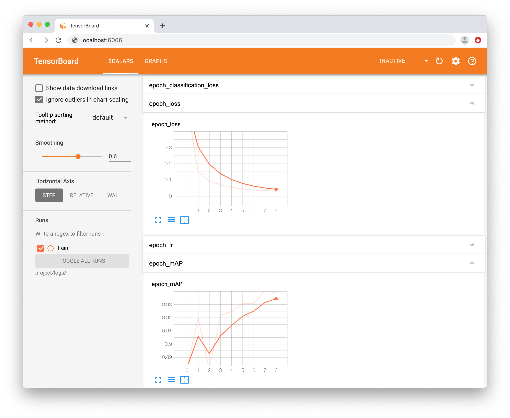

# Keras RetinaNet 工程实践

## 训练自己的数据集
* 标注数据
[LabelImg](https://github.com/tzutalin/labelImg)

```bash
# 标注后的目录结构
project
└── labelimg
    ├── 20190128155421222575013.jpg
    ├── 20190128155421222575013.xml
    ├── 20190128155703035712899.jpg
    ├── 20190128155703035712899.xml
    ├── 20190129091126392737624.jpg
    └── 20190129091126392737624.xml
```

* 运行容器
```bash
$ sudo docker run -it --runtime=nvidia --name=keras-retinanet -p 8888:8888 -p 6006:6006 \
                -v /home/wjunjian/ailab/datasets/helmet:/keras-retinanet/project \
                gouchicao/keras-retinanet bash
```

* voc转csv格式，分隔数据集
```bash
$ python voc2csv.py --data_dir=project/labelimg/ --output_dir=project/dataset
```

```bash
# 生成的目录结构
project
├── dataset
│   ├── class.csv
│   ├── train
│   │   ├── 20190128155421222575013.jpg
│   │   ├── 20190128155421222575013.xml
│   │   ├── 20190129091126392737624.jpg
│   │   └── 20190129091126392737624.xml
│   ├── train.csv
│   ├── val
│   │   ├── 20190128155703035712899.jpg
│   │   └── 20190128155703035712899.xml
│   └── val.csv
└── labelimg
    ├── 20190128155421222575013.jpg
    ├── 20190128155421222575013.xml
    ├── 20190128155703035712899.jpg
    ├── 20190128155703035712899.xml
    ├── 20190129091126392737624.jpg
    └── 20190129091126392737624.xml
```

* 模型训练
```bash
$ python keras_retinanet/bin/train.py --tensorboard-dir=project/logs --snapshot-path project/snapshots \
    csv project/dataset/train.csv project/dataset/class.csv --val-annotations project/dataset/val.csv

$ ll -h project/models/resnet50_csv_01.h5
-rw-r--r-- 1 root     root     417M 7月  27 22:58 resnet50_csv_01.h5
```

* 训练过程可视化 TensorBoard
```bash
$ tensorboard --logdir=project/logs --bind_all
```
在本机浏览器中访问网址:[http://localhost:6006](http://localhost:6006)


* 模型评估
```bash
$ python keras_retinanet/bin/evaluate.py csv project/dataset/val.csv project/dataset/class.csv \
    project/snapshots/resnet50_csv_01.h5 --convert-model
```

* 模型转换
```bash
$ python keras_retinanet/bin/convert_model.py --no-class-specific-filter \
    project/snapshots/resnet50_csv_01.h5 project/models/retinanet_inference.h5

$ ll -h project/models/retinanet_inference.h5
-rw-r--r-- 1 root     root     140M 7月  27 23:14 retinanet_inference.h5
```

* 模型预测
```bash
$ python predict.py --model project/models/retinanet_inference.h5 \
    --class_csv project/dataset/class.csv \
    --data_dir project/test \
    --predict_dir project/predict
```

## 添加[keras-retinanet](https://github.com/fizyr/keras-retinanet.git)作为子模块到我的git项目

```bash
$ git submodule add https://github.com/fizyr/keras-retinanet.git

正克隆到 '/home/wjunjian/github/gouchicao/keras-retinanet/keras-retinanet'...
remote: Enumerating objects: 5862, done.
remote: Total 5862 (delta 0), reused 0 (delta 0), pack-reused 5862
接收对象中: 100% (5862/5862), 13.40 MiB | 1.96 MiB/s, 完成.
处理 delta 中: 100% (3948/3948), 完成.
```

```bash
$ git status

位于分支 master
您的分支与上游分支 'origin/master' 一致。

要提交的变更：
  （使用 "git reset HEAD <文件>..." 以取消暂存）

	修改：     .gitmodules
	新文件：   keras-retinanet
```

```bash
$ git diff --cached keras-retinanet

diff --git a/keras-retinanet b/keras-retinanet
new file mode 160000
index 0000000..c38d547
--- /dev/null
+++ b/keras-retinanet
@@ -0,0 +1 @@
+Subproject commit c38d54795ee85722104fd005c04b2240d088b1a2
```

```bash
$ git diff --cached --submodule

diff --git a/.gitmodules b/.gitmodules
new file mode 100644
index 6ae1f70..3e5f0cd 100644
--- a/.gitmodules
+++ b/.gitmodules
@@ -0,0 +1,3 @@
+[submodule "keras-retinanet"]
+       path = keras-retinanet
+       url = https://github.com/fizyr/keras-retinanet.git
Submodule keras-retinanet 0000000...c38d547 (new submodule)
```

```bash
$ git commit -am "add keras-retinanet module"

[master 5fa8be7] add keras-retinanet module
 2 files changed, 4 insertions(+)
 create mode 100644 .gitmodules
 create mode 160000 keras-retinanet
```

```bash
$ git push origin master

对象计数中: 3, 完成.
Delta compression using up to 6 threads.
压缩对象中: 100% (3/3), 完成.
写入对象中: 100% (3/3), 384 bytes | 384.00 KiB/s, 完成.
Total 3 (delta 1), reused 0 (delta 0)
remote: Resolving deltas: 100% (1/1), completed with 1 local object.
To https://github.com/gouchicao/keras-retinanet.git
   c04a28e..5fa8be7  master -> master
```

## keras-retinanet容器
* 构建容器镜像
```bash
$ sudo docker build -t gouchicao/keras-retinanet .
```

* 上传容器镜像
```bash
$ sudo docker push gouchicao/keras-retinanet:latest
```

* 运行容器
```bash
$ sudo docker run -it --runtime=nvidia --name=keras-retinanet -p 8888:8888 -p 6006:6006 \
                -v /home/wjunjian/ailab/datasets/helmet:/keras-retinanet/project \
                gouchicao/keras-retinanet bash
```

* 删除容器
```bash
$ sudo docker rm keras-retinanet
```
